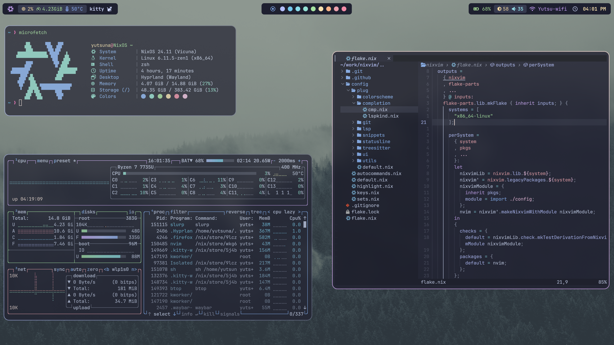
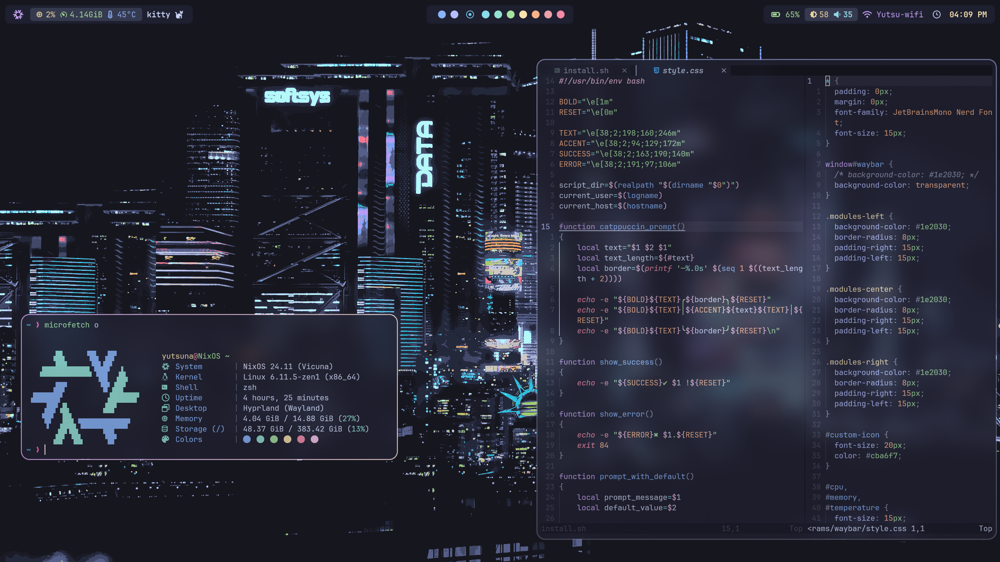

<h1 align="center">
    
   <br>
      My NixOS system
   <br>
       <br>
   <div align="center">

   <div align="center">
      <p></p>
      <div align="center">
         <a href="https://github.com/Leorevoir/NixOS/stargazers">
            
         </a>
         <a href="https://github.com/Leorevoir/NixOS/">
            
         </a>
         <a = href="https://nixos.org">
            
         </a>
         <a href="https://github.com/Leorevoir/NixOS/blob/main/LICENSE">
            
         </a>
      </div>
      <br>
   </div>
</h1>




# Install

> [!Note]
>
> <p>Default GPU drivers are AMD.<br>
> If you want to change this then edit the imports in ./hosts/Default/configuration.nix.</p>

## Using the install script

```bash
nix run --experimental-features "nix-command flakes" nixpkgs#git clone https://github.com/Leorevoir/NixOS.git ~/NixOS
```

```bash
cd ~/NixOS
```

```bash
./install.sh
```

## Rebuild when you make changes

```bash
./install.sh --rebuild
```

### Credits/Inspiration

https://github.com/Sly-Harvey/NixOS/
